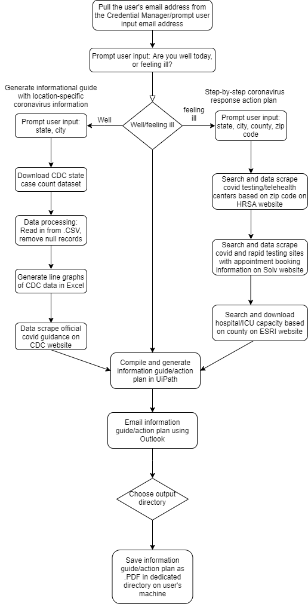

# Life in the Time of Corona

## In-Progress Idea List
* Do you need to call a nurse?
     * How to call a nearby nurse: online directory / through a service?
     * Distinction between calling a nurse and getting telehealth from your doctor
* Email address: Pull the user's own email address from Windows Credential Manager on the user's machine/Prompt the user to enter their loved one's email address
    * Definition of loved one/significant other: demonstrably in relationship for 5 years (sensitive information in email)
    * What if the user is using macOS instead?
* Email section containing Solv Health testing appointment booking link list: how to ensure the link stays live and you are not double booking?
* Mann's ML idea

## Project Proposal

### Description
Our project will automate the creation of a comprehensive coronavirus informational summary/step-by-step personal plan of action for the user to follow in "the time of corona", based on the user's own wellness or ill health.
The information guide/action plan will contain location-specific information based on the user's state, county, city and zip code, and will be emailed to the user/user's loved one as well as saved as a .PDF file in a dedicated directory on the user's machine.

### Automation
1. Prompt user input:
    * User's own wellness or ill health
    * User's state, county, city, zip code
    * User's/user's loved one's email address
2. Filter/download [state daily case count data on CDC website](https://data.cdc.gov/Case-Surveillance/United-States-COVID-19-Cases-and-Deaths-by-State-o/9mfq-cb36/data)
3. Scrape data from downloaded .CSV file
4. Data processing: read in data from .CSV, remove null records
5. Generate graphs with Excel
6. Data scraping of [official covid guidance from CDC website](https://www.cdc.gov/coronavirus/2019-ncov/hcp/duration-isolation.html)
7. Search and data scrape covid testing sites/telehealth centers based on zip code on [HRSA website](https://findahealthcenter.hrsa.gov/)
8. Search and data scrape covid and rapid testing sites with appointment booking information on [Solv website](https://www.solvhealth.com/)
9. Search and download hospital/ICU capacity based on county on [ESRI website](https://coronavirus-resources.esri.com/datasets/definitivehc::definitive-healthcare-usa-hospital-beds/)
10. Compile and generate information guide/action plan in UiPath
11. Email information guide/action plan using Outlook
12. Save information guide/action plan as .PDF in dedicated directory on user's machine

### Tech Stack
UiPath
* Excel activities
* Outlook activities
* .PDF activities
* Data scraping

### Flowchart

### Team Pi
Nicole Holden, James Mann, Angela Li
