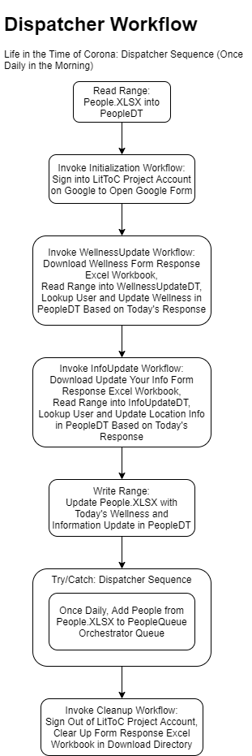
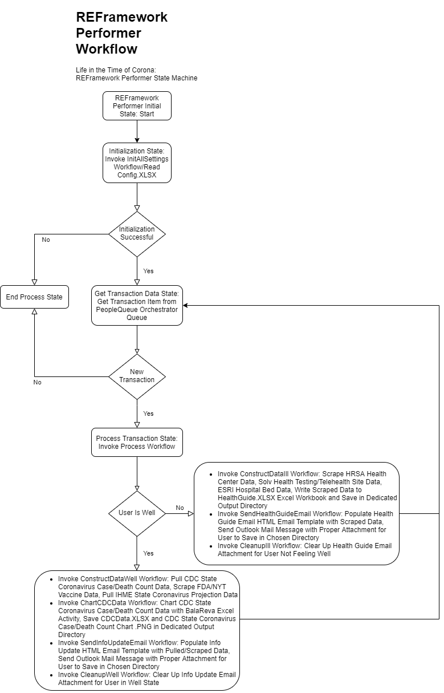

# Life in the Time of Corona

## Project Description

Our project automates the creation of a comprehensive coronavirus informational summary/step-by-step personal plan of action for the user to follow in "the time of corona", based on the user's own wellness or ill health. The information guide/action plan contains location-specific information based on the user's state, county, city and zip code, and is emailed to the user/user's loved one as well as sent with complete data attached for the user to save on his/her own machine in the chosen directory.

## Tech Stack

* UiPath Studio
* UiPath Orchestrator
* Excel
* Outlook

## Flowchart

Our project is implemented with the Dispatcher/Performer model, and our Performer is built on REFramework.

## Functionality

* Send daily email to the user containing scraped data in the form of Information Update/Health Guide, based on the user's own wellness, reported in form contained in the email
* Implement form functionality to allow the user to update his/her wellness and information from the email daily
* Pull form response Excel sheet and update People.XLSX workbook daily in the Dispatcher workflow, populate PeopleQueue Orchestrator Queue once daily

## Getting Started

* Copy the Life in the Time of Corona project repository onto your machine using the `git clone` command
* Open the Dispatcher Workflow in UiPath Studio, Publish to Orchestrator
* Open the Performer Workflow in UiPath Studio, Publish to Orchestrator
* Create PeopleQueue Orchestrator Queue
* Save Project Orchestrator Assets/Credentials
* Configure Outlook/Google with Life in the Time of Corona project account
* Create Dispatcher process from published package, Set up daily trigger based on time in the morning, every morning
* Create Performer process from published package, Set up queue-based trigger tied to PeopleQueue Orchestrator Queue

## Contributors

Nicole Holden, James Mann, Angela Li

## License

This project uses the following license: [MIT License](LICENSE).
